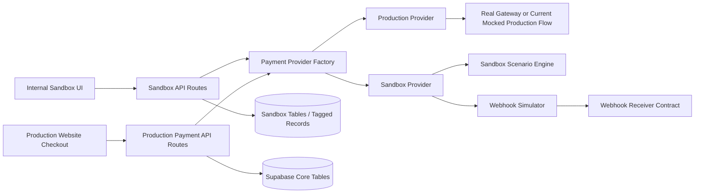
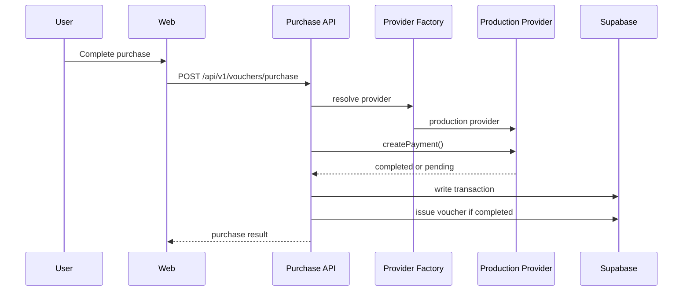
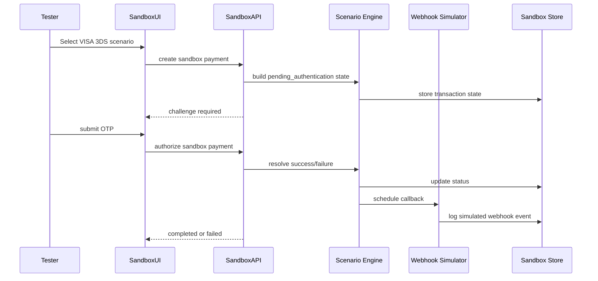
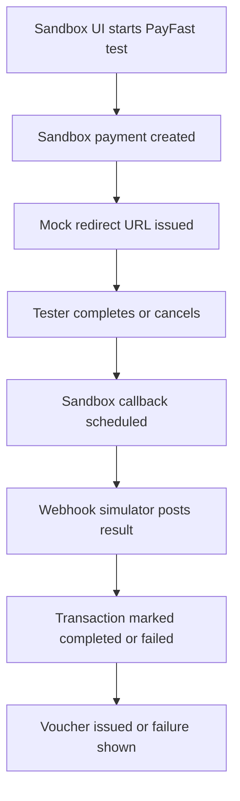
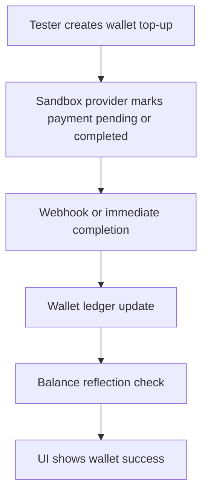

# eVoucher Payment Sandbox Plan

## Purpose
This document is a planning and handover report for designing a proper **eVoucher payment sandbox** that simulates near-live payment behavior without putting production checkout, wallet top-ups, voucher issuance, or customer-facing flows at risk.

It is intended for:
- eVoucher product and engineering leadership
- Base44 design and architecture teams
- internal IT, security, and QA teams
- delivery teams responsible for staging, testing, and rollout

---

## Executive Summary
The recent regression proved that sandbox logic must not be introduced directly into the live payment path. The production website became stable again after rollback, which confirms that sandbox simulation needs to be **isolated**, **feature-flagged**, and **operationally separate** from the real production purchase flow.

The recommended solution is:
- keep production payment flows unchanged and protected
- build a dedicated sandbox payment provider behind an abstraction layer
- expose sandbox-only routes for simulation
- provide an internal sandbox UI for testing payment scenarios
- simulate realistic payment lifecycle behavior, including redirects, OTP, callbacks, retries, delays, and failures
- validate everything in staging before controlled rollout

---

## Problem Statement
eVoucher needs a safe way to simulate payment behavior for business, QA, and partner demonstrations without:
- breaking production checkout
- mixing simulation code into live consumer purchase endpoints
- creating false positives in wallet balances, voucher issuance, or settlement reporting
- confusing internal teams about whether a transaction is real or simulated

The sandbox should support:
- VISA Secure 3DS challenge
- debit/credit card success and failure
- PayFast redirect and callback
- EFT proof flow
- PayShap instant payment simulation
- wallet top-up and wallet balance reflection
- webhook retries and delayed completion

---

## Design Principles
1. **Production safety first**
   Production checkout must continue to work even if sandbox services fail.

2. **Strict isolation**
   Sandbox routes, storage, provider logic, and test UI must be separate from live customer payment paths.

3. **Single provider contract**
   Production and sandbox implementations should both satisfy the same payment provider interface.

4. **Scenario-driven simulation**
   The sandbox should simulate payment outcomes intentionally, not by ad hoc code branches.

5. **Observable behavior**
   Every simulated payment should emit logs, audit events, test scenario metadata, and webhook traces.

6. **Controlled rollout**
   Sandbox functionality should be enabled only by environment and role-based access.

---

## Recommended Architecture

### High-Level View


### Core Recommendation
Production routes should not directly import or depend on sandbox services. Instead:
- production routes call a provider factory
- the provider factory resolves the active provider by environment
- sandbox APIs call sandbox services directly
- internal testers use a sandbox UI, not the public checkout page

---

## Best-Fit Component Model

### 1. Payment Provider Abstraction
Create a single contract such as:

```ts
export interface PaymentProvider {
  createPayment(input: PaymentCreateInput): Promise<PaymentCreateResult>;
  getPaymentStatus(reference: string): Promise<PaymentStatusResult>;
  verifyWebhook(input: PaymentWebhookVerificationInput): Promise<boolean>;
  normalizeStatus(rawStatus: string): 'pending' | 'completed' | 'failed';
}
```

### 2. Provider Implementations
- `production-provider.ts`
  Used by live checkout and live wallet top-up
- `sandbox-provider.ts`
  Used only in sandbox mode or sandbox routes

### 3. Provider Factory
- `payment-provider-factory.ts`
  Chooses the provider based on:
  - environment
  - route context
  - feature flags
  - user role

### 4. Sandbox Scenario Engine
Scenario engine controls:
- immediate success
- delayed success
- delayed failure
- OTP required
- redirect required
- callback retry
- proof pending
- wallet top-up reflection delay

### 5. Webhook Simulator
Should simulate:
- initial callback
- duplicate callback
- delayed callback
- retry after timeout
- failed signature
- out-of-order callback

---

## Proposed Folder Structure
```text
src/
  app/
    api/
      v1/
        vouchers/
          purchase/route.ts
        wallet/
          topup/route.ts
        payments/
          webhook/route.ts
        sandbox/
          payments/
            create/route.ts
            authorize/route.ts
            [ref]/status/route.ts
          webhooks/
            trigger/route.ts
            retry/route.ts
          wallet/
            topup/route.ts
          eft/
            submit-proof/route.ts
          payshap/
            push/route.ts
          scenarios/
            route.ts
    sandbox-payments/
      page.tsx

  server/
    services/
      payment/
        payment-provider.ts
        payment-provider-factory.ts
        production-provider.ts
        sandbox-provider.ts
        sandbox-scenario-engine.ts
        sandbox-webhook-simulator.ts
        sandbox-audit.ts
```

---

## Environment Strategy

### Required Modes
- `production`
  Real customer-facing environment
- `staging`
  Full sandbox simulation and QA validation
- `development`
  Local developer simulation

### Recommended Environment Variables
```env
PAYMENT_MODE=production
PAYMENT_SANDBOX_ENABLED=false
PAYMENT_SANDBOX_UI_ENABLED=false
PAYMENT_SANDBOX_WEBHOOK_SECRET=
PAYMENT_SANDBOX_ALLOWED_ORIGINS=
PAYMENT_SANDBOX_DEFAULT_SCENARIO=card_success
PAYMENT_SANDBOX_CALLBACK_BASE_URL=
PAYMENT_SANDBOX_LATENCY_MS=0
PAYMENT_SANDBOX_ROLE_ALLOWLIST=admin,qa,finance
```

### Important Rule
On public production:
- `PAYMENT_MODE=production`
- `PAYMENT_SANDBOX_ENABLED=false`
- `PAYMENT_SANDBOX_UI_ENABLED=false`

---

## Supported Sandbox Scenarios

### VISA Secure 3DS Challenge
Simulate:
- card accepted
- OTP challenge shown
- OTP success
- OTP failure
- OTP timeout
- retry after failure

Expected states:
- `initiated`
- `pending_authentication`
- `authorized`
- `completed`
- `failed`
- `expired`

### Debit/Credit Card Success and Failure
Simulate:
- immediate success
- insufficient funds
- issuer decline
- network failure
- delayed completion
- duplicate authorization response

### PayFast Redirect and Callback
Simulate:
- redirect to hosted payment page
- customer return
- asynchronous callback
- callback retry
- cancelled redirect
- paid but callback delayed

### EFT Proof Flow
Simulate:
- payment initiated
- proof uploaded
- proof review pending
- proof approved
- proof rejected
- expired proof window

### PayShap Instant Payment
Simulate:
- request-to-pay generated
- customer accepts in bank app
- instant success callback
- delayed settlement notice
- expired PayShap token
- customer abandonment

### Wallet Top-Up and Reflection
Simulate:
- immediate balance update
- delayed wallet credit
- duplicate top-up callback
- callback success but UI refresh lag
- failed top-up reversal

### Webhook Retries and Delayed Completion
Simulate:
- first webhook success
- first webhook failure, second retry success
- duplicate webhook event
- webhook signature error
- completed payment but delayed callback processing

---

## Recommended Data Model

### Option A: Separate Sandbox Tables
Best for strong isolation.

Example:
- `sandbox_payment_transactions`
- `sandbox_wallet_transactions`
- `sandbox_webhook_events`
- `sandbox_scenarios`
- `sandbox_eft_proofs`

### Option B: Shared Tables with Mandatory Sandbox Tagging
Use only if separate tables are too heavy initially.

Required fields:
- `is_sandbox boolean`
- `sandbox_scenario_key text`
- `sandbox_run_id uuid`
- `sandbox_operator_id uuid`

### Recommendation
Use **separate sandbox tables** for payment lifecycle and webhook simulation, while optionally allowing voucher creation to write into shared tables only when explicitly required for end-to-end demo behavior.

---

## API Design

### Production-Safe Routes
These remain customer-facing:
- `/api/v1/vouchers/purchase`
- `/api/v1/wallet/topup`
- `/api/v1/payments/webhook`

These routes should:
- call the provider factory
- never import sandbox internals directly
- be stable in production even when sandbox is disabled

### Sandbox-Only Routes
- `/api/v1/sandbox/payments/create`
- `/api/v1/sandbox/payments/authorize`
- `/api/v1/sandbox/payments/[ref]/status`
- `/api/v1/sandbox/webhooks/trigger`
- `/api/v1/sandbox/webhooks/retry`
- `/api/v1/sandbox/wallet/topup`
- `/api/v1/sandbox/eft/submit-proof`
- `/api/v1/sandbox/payshap/push`
- `/api/v1/sandbox/scenarios`

These should require:
- admin or QA role
- sandbox environment enabled
- internal auth or API key

---

## Sandbox UI

### Purpose
Provide a private internal page for controlled testing, not a public customer route.

### Suggested Page
- `/sandbox-payments`

### Features
- choose payment method
- choose scenario
- set latency/delay
- trigger webhook retries
- simulate redirect return
- upload EFT proof
- generate PayShap request
- top up wallet
- inspect resulting transaction state

### UI Panels
- scenario selector
- transaction lifecycle tracker
- webhook log
- wallet reflection panel
- voucher issuance preview
- audit metadata viewer

---

## Flow Diagrams

### 1. Production Purchase Flow


### 2. Sandbox 3DS Flow


### 3. PayFast Redirect Simulation


### 4. Wallet Top-Up Reflection


---

## Security and Governance
- sandbox routes must require internal authentication
- sandbox UI must not be public
- sandbox webhook secrets must be different from production
- sandbox transactions must be clearly labeled in audit logs
- sandbox notifications must never send real customer-facing finance notices unless explicitly allowed
- sandbox payout, settlement, and wallet artifacts must not pollute production reporting

---

## Logging and Audit Requirements
For every sandbox run, capture:
- `sandbox_run_id`
- `scenario_key`
- operator identity
- created payment reference
- state transitions
- webhook attempts
- retry counts
- callback payloads
- wallet reflection outcome
- voucher issuance outcome

This is essential for:
- QA reproducibility
- incident analysis
- demo confidence
- internal audit clarity

---

## Testing Strategy

### Automated Tests
- provider factory resolution tests
- sandbox provider scenario tests
- production provider regression tests
- webhook retry idempotency tests
- wallet reflection tests
- voucher issuance tests
- PayFast redirect return tests
- EFT proof review flow tests
- PayShap success and timeout tests

### Manual Test Packs
- internal QA checklist
- finance/ops validation checklist
- business demo script
- partner demonstration script

---

## Suggested Delivery Phases

### Phase 1: Sandbox Design Doc
Deliverables:
- approved architecture
- flow diagrams
- scenario catalog
- environment model
- security model

### Phase 2: Payment Provider Abstraction
Deliverables:
- provider contract
- provider factory
- production provider isolation
- regression tests on current live flow

### Phase 3: Isolated Sandbox API Routes
Deliverables:
- sandbox payment endpoints
- sandbox scenario engine
- sandbox transaction storage
- role-based access controls

### Phase 4: Internal Sandbox Test UI
Deliverables:
- private sandbox dashboard
- transaction scenario runner
- webhook inspector
- wallet top-up simulator
- PayFast and PayShap scenario controls

### Phase 5: Webhook Simulator
Deliverables:
- manual trigger
- retry trigger
- delayed callback scheduling
- duplicate callback simulation
- signature validation scenarios

### Phase 6: Staging Validation
Deliverables:
- staging deployment
- end-to-end test evidence
- defect log
- sign-off report

### Phase 7: Controlled Rollout
Deliverables:
- feature flags
- environment guardrails
- restricted access
- production protection checks
- operational runbook

---

## Recommended Rollout Strategy
1. Freeze current production flow as baseline
2. Build sandbox only in staging and development
3. Validate all scenarios with internal QA
4. Enable sandbox UI only for admin and QA roles
5. Add observability and audit logs
6. Run pilot demonstrations internally
7. Only then expose controlled sandbox capability for partner demos

---

## Key Risks and Mitigations

### Risk: Sandbox logic leaks into production
Mitigation:
- feature flags
- separate imports
- environment assertions
- CI guardrails

### Risk: Sandbox transactions pollute real wallet or reporting
Mitigation:
- separate sandbox tables
- sandbox tagging
- reporting exclusions

### Risk: Webhook simulator behaves differently from production contract
Mitigation:
- shared webhook schema
- contract tests
- replay harness

### Risk: Internal teams confuse simulated success with real money movement
Mitigation:
- visible sandbox labels
- separate dashboards
- no live bank settlement effects

---

## Recommended Handover to Base44
Base44 should be asked to produce:
- architecture report
- refined system context diagram
- sequence diagrams for each payment method
- sandbox UI wireframes
- API contract definitions
- webhook retry model
- test scenario catalog
- rollout and support runbook

### Specific Base44 Handover Questions
1. How should sandbox and production providers be separated in code and deployment?
2. Should sandbox transaction data live in separate tables or separate schema?
3. What is the best user flow for 3DS, PayFast, EFT, PayShap, and wallet simulation?
4. How should callback retries be orchestrated and observed?
5. What security model is needed for internal-only sandbox access?
6. What staging evidence is required before any rollout?

---

## Final Recommendation
The best architecture for eVoucher is:
- keep live payment routes stable and minimal
- add a provider abstraction
- build sandbox as an isolated simulation platform
- use separate routes, separate controls, and separate operational rules
- validate in staging before any controlled enablement

This approach gives eVoucher:
- production safety
- realistic payment simulation
- clearer partner demos
- better QA reproducibility
- stronger operational governance

---

## Proposed Next Document
After approval of this plan, the next document should be:

`docs/PAYMENT_SANDBOX_IMPLEMENTATION_SPEC.md`

That document should contain:
- exact API contracts
- exact database schema changes
- UI wireframes
- scenario payload examples
- webhook payload examples
- acceptance criteria
- implementation sequence by sprint
